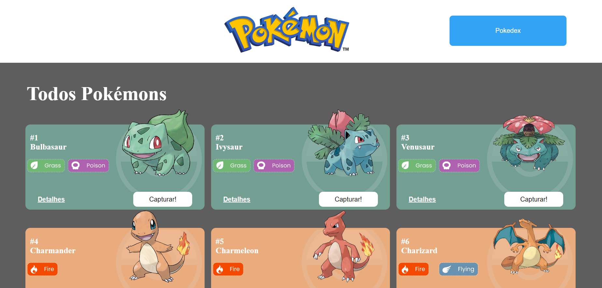
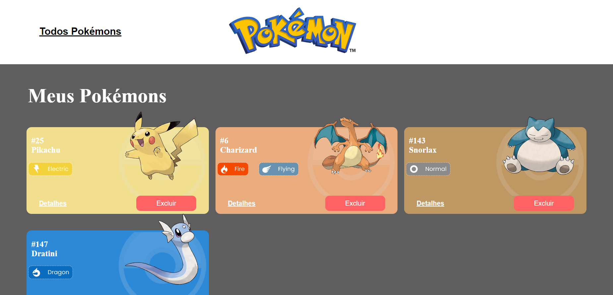
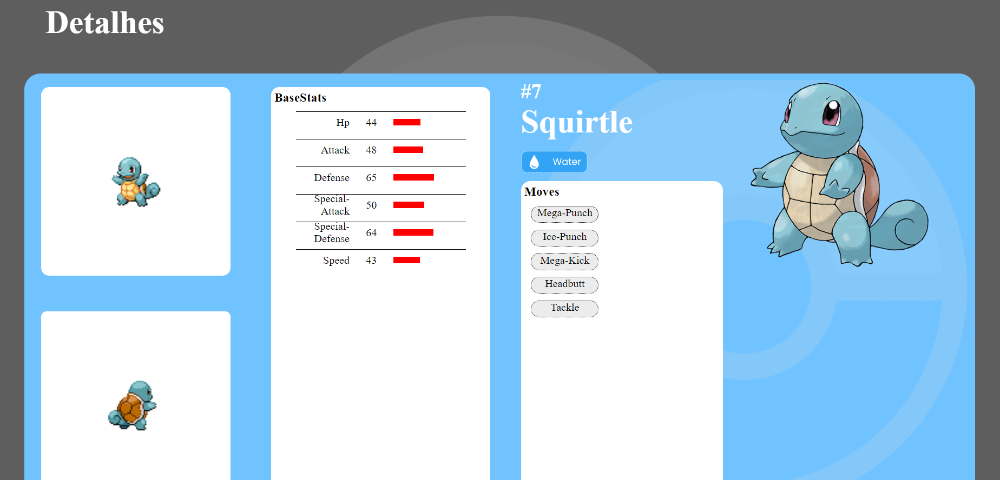

# Pokédex


Projeto feito utilizando a API de pokémon.

## Índice

- <a href="#funcionalidades do projeto">Funcionalidades do Projeto</a>
- <a href="#layout">Layout</a>
- <a href="#demonstração">Demonstração</a>
- <a href="#tecnologias">Tecnologias Utilizadas</a>

## Funcionalidades do Projeto

- **Gerais:**

  - O site tem 3 páginas: Home, Pokédex e Detalhes

- **Página Home:**

  - [x] Mostrar uma lista de Pokemons, contendo ao menos 20 Pokemons;
  - [x] Cada Pokemon será representado por um Card;
  - [x] Em cada card de Pokemon tem um botão para adicioná-lo à Pokedex e um outro botão para acessar os detalhes do Pokemon;
  - [x] Header dessa página terá um botão para acessar a página da Pokedex
  - [x] Mudar página e renderizar outros pokémons

- **Página Pokédex**
  - [x] Renderizar a lista de pokémons adicionados na pokedex;
  - [x] Em cada card de Pokemon deve ter um botão para removê-lo da Pokedex e um outro botão para acessar os detalhes do Pokemon.
  - [x] Header deve ter um botão para voltar para a Home
  - [x] Não deve ser possível adicionar o mesmo Pokemon duas vezes na Pokedex
- **Página de Detalhes**
  - [x] Mostrar os detalhes do Pokemon selecionado, com informações descritas
  - [x] Header deve ter um botão para adicionar ou remover da Pokedex e outro para voltar a página home.

## Layout

- HomePage



- Pokedex



- Detalhes



## Demonstração

[Link demonstração](https://projeto-pokedex-barbosa-leonardotiburcio.surge.sh)

## Como rodar este projeto?

```
# clone este repositorio
$ git clone https://github.com/leoh3nrique/Projeto-PokeDex.git

# Acesse a pasta do projeto no seu terminal
$  cd Projeto-PokeDex/

# Instale as depedências
$ npm install

# Execute a aplicação
$ npm run start

# A aplicação sera iniciada na porta 300,
acesse pelo navegador: http:http://localhost:3000
```

## Tecnologias Utilizadas

1. [React](https://pt-br.reactjs.org)
2. [React-Router](https://reactrouter.com/en/main)
3. [Axios](https://axios-http.com/ptbr/docs/intro)
4. [React Context](https://reactjs.org/docs/context.html)
5. [Styled Components](https://styled-components.com)

## Pessoas autoras


[Linkedin](https://www.linkedin.com/in/leonardo-henrique-a82a91242/)
